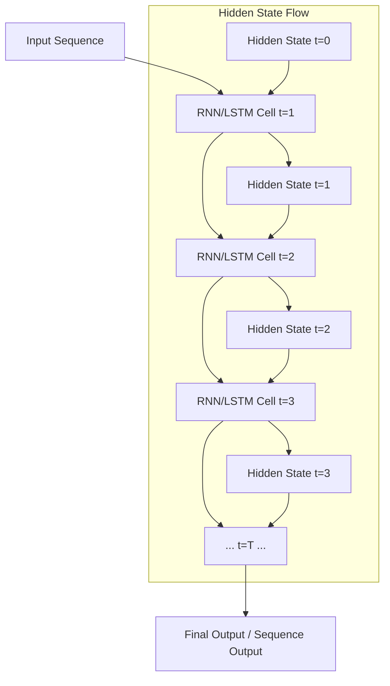
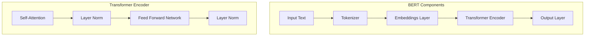
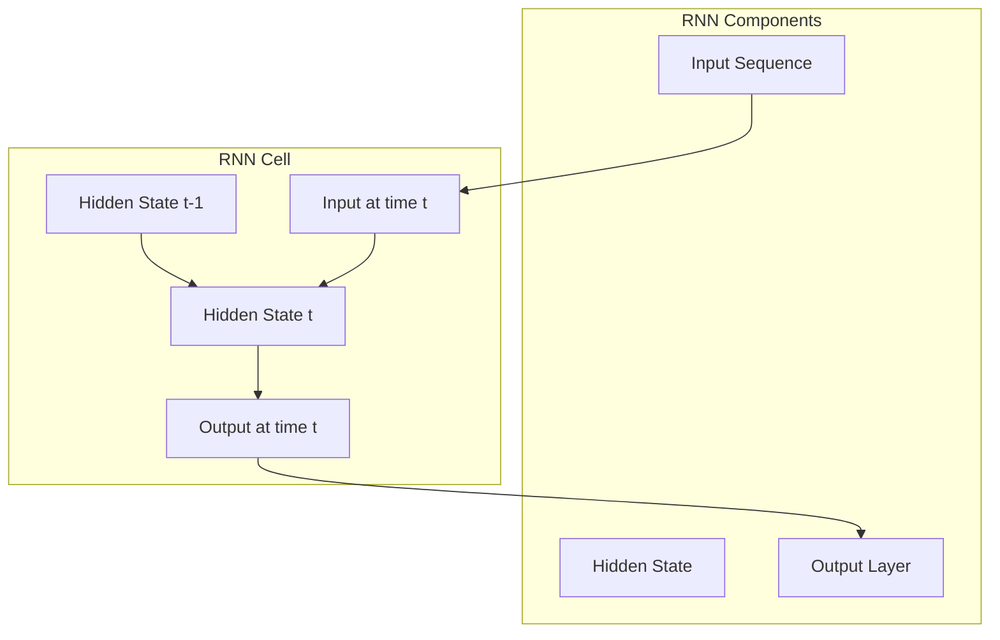

# BERT and RNN Architecture Diagrams

## BERT Architecture
```mermaid
graph TD
    A[Input Text] --> B[Tokenization]
    B --> C[Input Embeddings]
    C --> D[Positional Embeddings]
    D --> E[Sum + LayerNorm + Dropout]
    E --> F[Transformer Encoder Layer 1]
    F --> G[Transformer Encoder Layer 2]
    G --> H[... N Layers ...]
    H --> I[Final Encoder Output]
    I --> J[Task-specific Head (e.g., Classification, QA, etc.)]
```

## RNN Architecture


## Detailed BERT Architecture


## Detailed RNN Architecture

