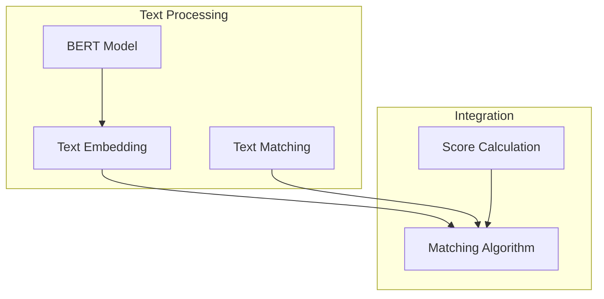
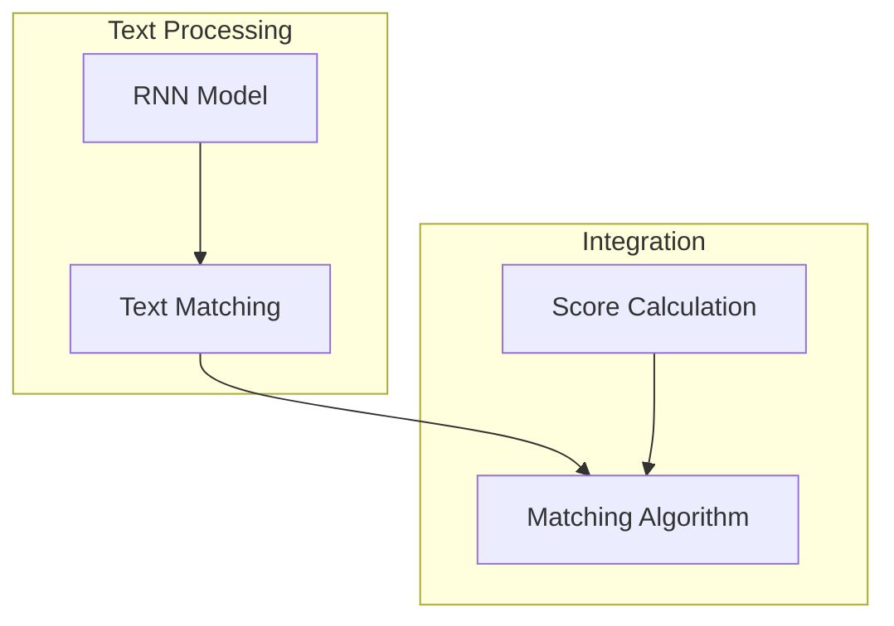
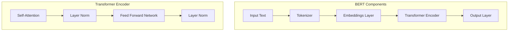
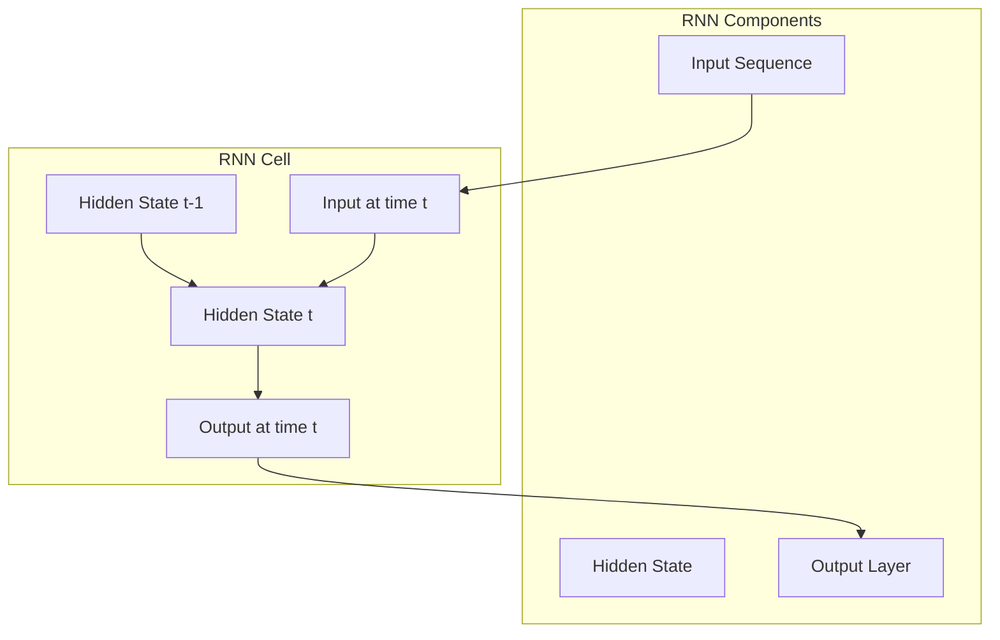

# BERT and RNN Architecture Diagrams

## BERT Architecture

```mermaid
graph TB
    subgraph Text Processing
        BERT[BERT Model]
        TextEmbed[Text Embedding]
        TextMatch[Text Matching]
    end

    subgraph Integration
        MatchAlgo[Matching Algorithm]
        ScoreCalc[Score Calculation]
    end

    BERT --> TextEmbed
    TextEmbed --> MatchAlgo
    TextMatch --> MatchAlgo
    ScoreCalc --> MatchAlgo
```

## RNN Architecture

```mermaid
graph TB
    subgraph Text Processing
        RNN[RNN Model]
        TextMatch[Text Matching]
    end

    subgraph Integration
        MatchAlgo[Matching Algorithm]
        ScoreCalc[Score Calculation]
    end

    RNN --> TextMatch
    TextMatch --> MatchAlgo
    ScoreCalc --> MatchAlgo
```

## Detailed BERT Architecture

```mermaid
graph TB
    subgraph BERT Components
        Input[Input Text]
        Tokenizer[Tokenizer]
        Embeddings[Embeddings Layer]
        Encoder[Transformer Encoder]
        Output[Output Layer]
    end

    subgraph Transformer Encoder
        SelfAttn[Self-Attention]
        FFN[Feed Forward Network]
        Norm1[Layer Norm]
        Norm2[Layer Norm]
    end

    Input --> Tokenizer
    Tokenizer --> Embeddings
    Embeddings --> Encoder
    Encoder --> Output

    SelfAttn --> Norm1
    Norm1 --> FFN
    FFN --> Norm2
```

## Detailed RNN Architecture

```mermaid
graph TB
    subgraph RNN Components
        Input[Input Sequence]
        Hidden[Hidden State]
        Output[Output Layer]
    end

    subgraph RNN Cell
        Xt[Input at time t]
        Ht1[Hidden State t-1]
        Ht[Hidden State t]
        Ot[Output at time t]
    end

    Input --> Xt
    Ht1 --> Ht
    Xt --> Ht
    Ht --> Ot
    Ot --> Output
``` 